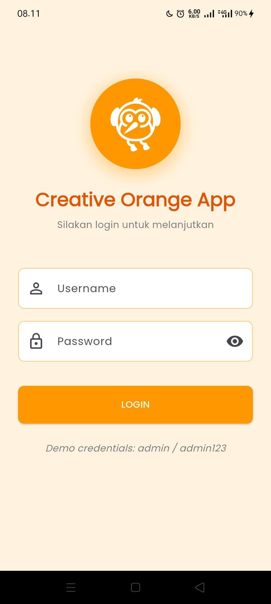
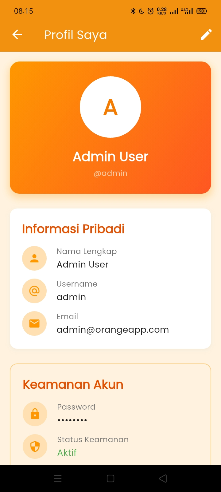
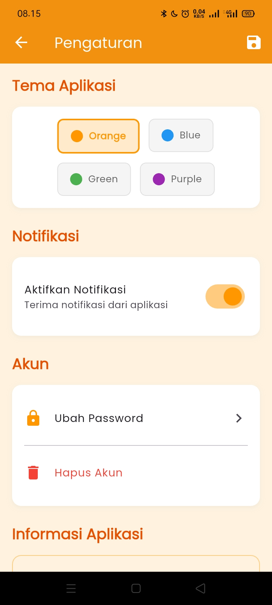
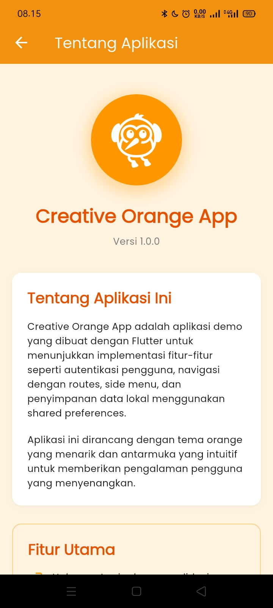
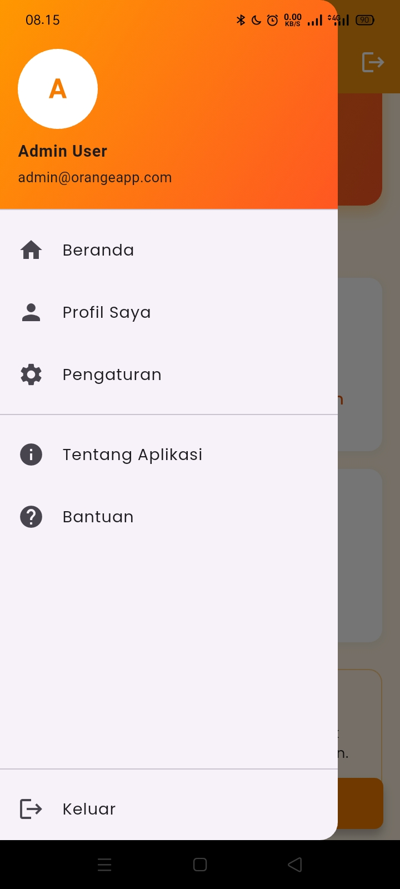

# 📱 H1D023023_Tugas7  

---
## Identitas
Nama  : Irfan Romadhon Widodo  
NIM   : H1D023023  
Shift : Shift D (Lama), Shift F (Baru)  

## 🧩 Deskripsi  
Proyek ini dibuat menggunakan **Flutter** untuk memenuhi tugas ke-7.  
Aplikasi ini menampilkan **form input data** yang diisi oleh pengguna, kemudian data tersebut dikirim (passing data) menuju halaman **tampilan hasil** untuk ditampilkan kembali di layar.

---

## 🛠️ Teknologi yang Digunakan  
- **Flutter & Dart**  
- (Tambahkan dependency yang digunakan di `pubspec.yaml`)  
- **Versi Flutter:** _(isi versi)_  
- **Platform Target:** Android / iOS  

---

## 🚀 Cara Menjalankan Aplikasi  

1. **Clone repositori**
   ```bash
   git clone https://github.com/IrfanRomadhonWidodo/H1D023023_Tugas7.git
   cd H1D023023_Tugas7
---
2. **Instal dependencies**
    ```bash
   flutter pub get
---
3. **Jalankan aplikasi**
    ```bash
    flutter run
---

## 🖼️ Asset Preview  
Semua gambar dari folder `assets/` ditampilkan lewat tabel biar rapih.

| Image 1                  | Image 2                 | Image 3                 |
| ------------------------ | ----------------------- | ----------------------- |
|  |  |  |
| Image 4                 | Image 5                 | Image 6                 |
|  |  |  |


> Catatan: Pastikan `README.md` berada di root repo agar gambar muncul dengan benar.

---
## 🎬 Demo Aplikasi


## ⚙️ Dependensi yang Digunakan

```yaml
dependencies:
  flutter:
    sdk: flutter
  shared_preferences: ^2.0.17
  flutter_svg: ^2.0.5
  google_fonts: ^4.0.3
  cupertino_icons: ^1.0.8
